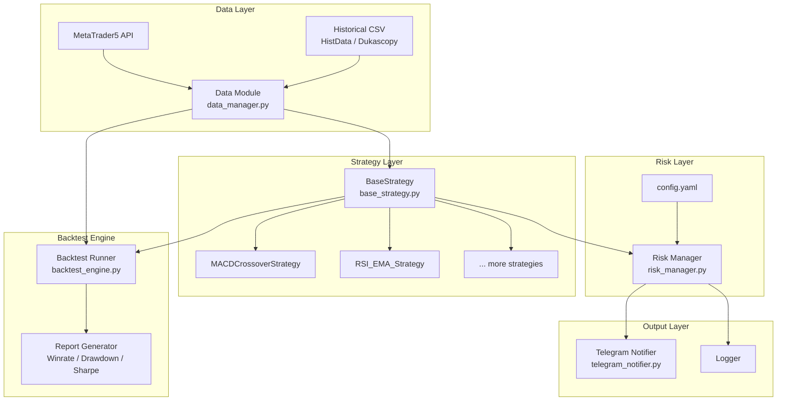
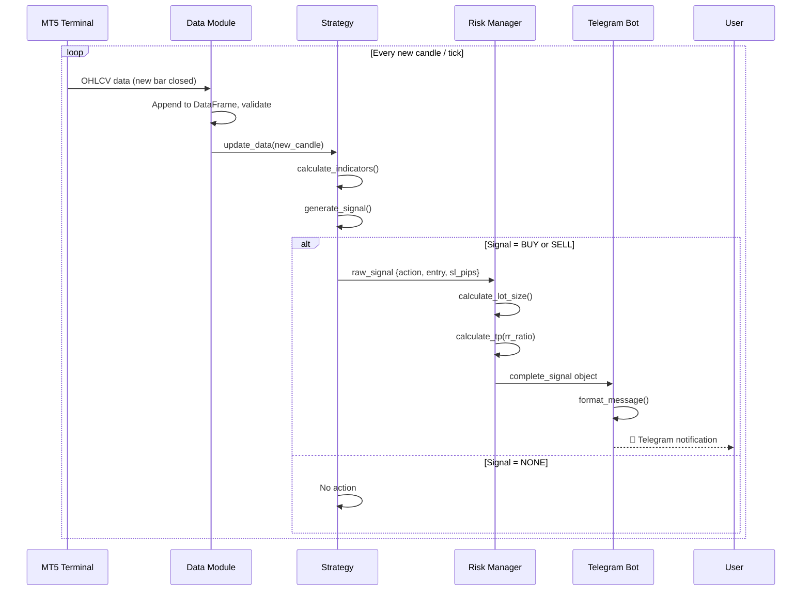
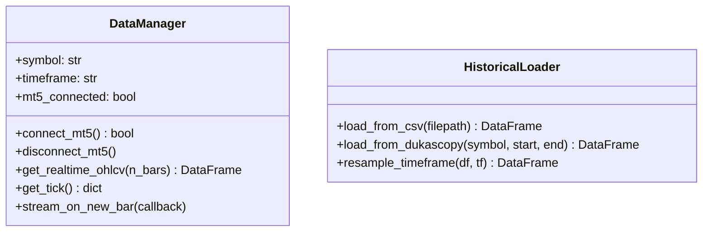
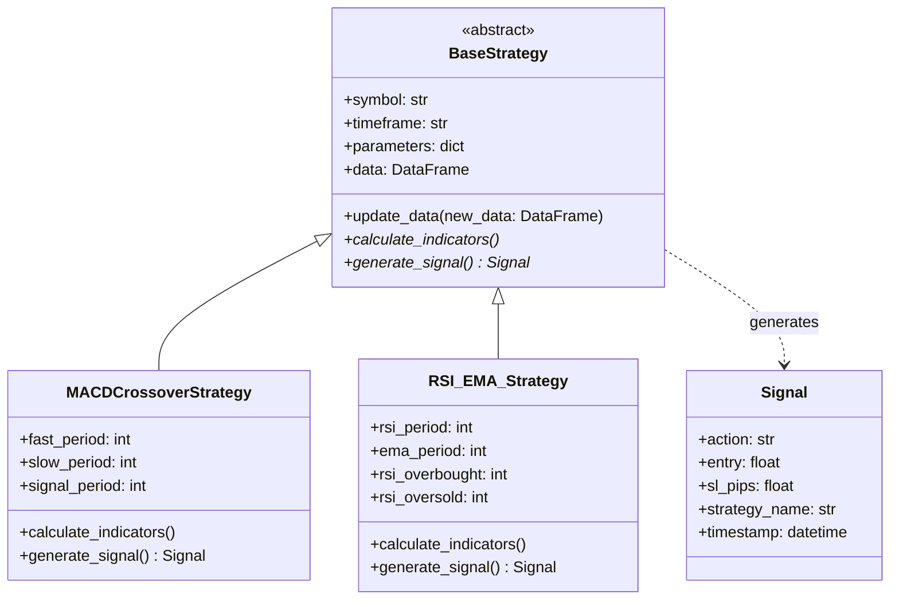
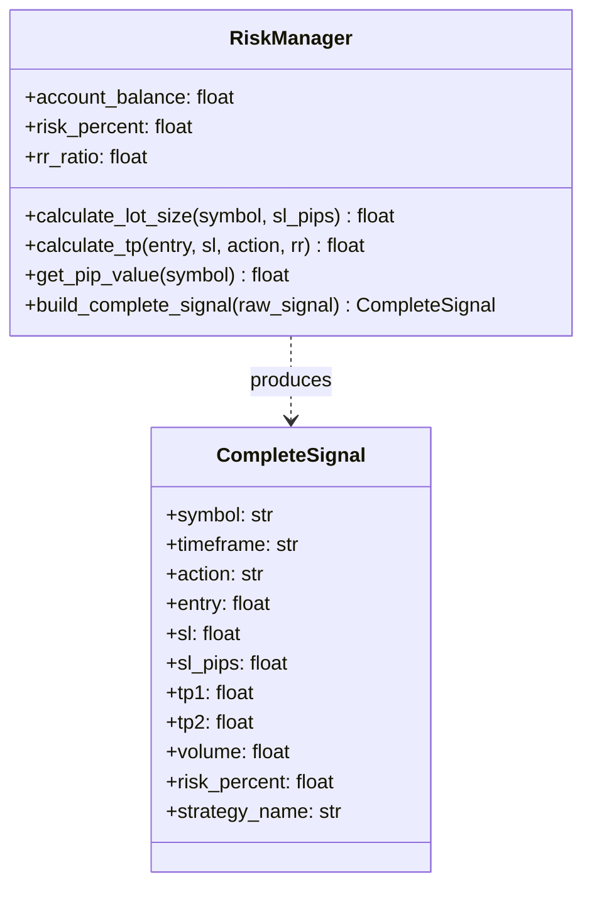
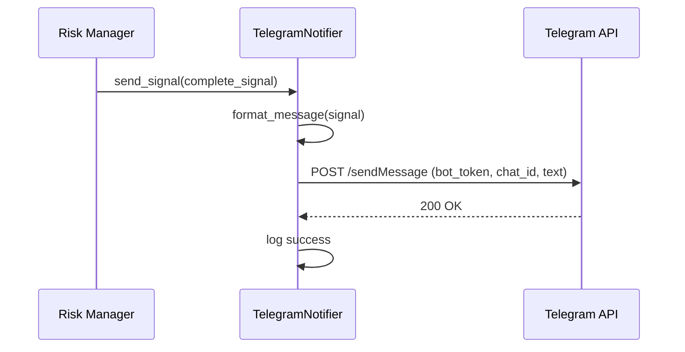
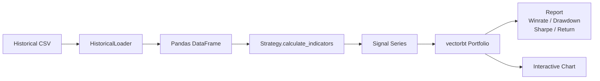
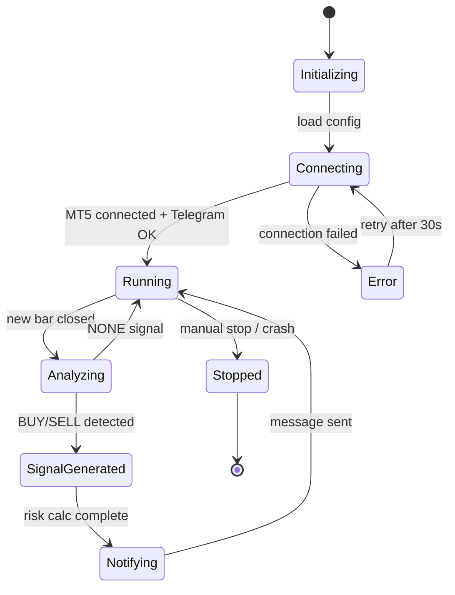

# Trading System — System Design & Architecture

**Date**: 20 Mar 2026  
**Status**: Draft  
**Version**: 1.0

---

## 1. Kiến trúc Tổng quan (High-Level Architecture)

Hệ thống theo kiến trúc **Micro-architecture** — các module độc lập, giao tiếp qua interface rõ ràng, dễ thay thế và mở rộng.



---

## 2. Luồng Dữ liệu Realtime (Realtime Data Flow)



---

## 3. Cấu trúc Thư mục Dự án (Project Structure)

```
trading-system/
├── config.yaml                  # Tất cả tham số cấu hình
├── main.py                      # Entry point — chạy realtime
├── backtest.py                  # Entry point — chạy backtest
│
├── src/
│   ├── data/
│   │   ├── __init__.py
│   │   ├── data_manager.py      # Kết nối MT5, tải OHLCV
│   │   └── historical_loader.py # Tải CSV từ HistData/Dukascopy
│   │
│   ├── strategies/
│   │   ├── __init__.py
│   │   ├── base_strategy.py     # Abstract BaseStrategy class
│   │   ├── macd_crossover.py    # MACDCrossoverStrategy
│   │   └── rsi_ema.py           # RSI + EMA Strategy
│   │
│   ├── risk/
│   │   ├── __init__.py
│   │   └── risk_manager.py      # Lot size, SL/TP calculator
│   │
│   ├── notifier/
│   │   ├── __init__.py
│   │   └── telegram_notifier.py # Gửi tín hiệu Telegram
│   │
│   └── backtest/
│       ├── __init__.py
│       ├── backtest_engine.py   # Chạy backtest với vectorbt
│       └── report_generator.py  # Xuất báo cáo
│
├── data/
│   └── historical/              # Lưu file CSV lịch sử
│
├── logs/
│   └── trading.log
│
├── docs/
│   └── ai/                      # AI-assisted dev docs
│
├── tests/
│   ├── test_risk_manager.py
│   ├── test_strategies.py
│   └── test_data_manager.py
│
└── requirements.txt
```

---

## 4. Thiết kế Chi tiết Từng Module

### 4.1 Data Module (`src/data/data_manager.py`)



**Quyết định thiết kế**: Sử dụng callback pattern (`stream_on_new_bar`) — mỗi khi nến mới đóng, gọi callback để tránh polling liên tục tiêu tốn CPU.

---

### 4.2 Strategy Module (`src/strategies/`)



---

### 4.3 Risk Management Module (`src/risk/risk_manager.py`)



**Công thức Pip Value**:
- FOREX (EURUSD, GBPUSD): `pip_value = 10 USD/pip/lot` (standard lot 100,000 units)
- XAUUSD (Vàng): `pip_value = 1 USD/pip/lot` (1 lot = 100 oz, 1 pip = $0.01)
  - Thực tế: `pip_value = contract_size × pip_size / quote_price × 1` — lấy từ MT5 symbol info

---

### 4.4 Telegram Notifier (`src/notifier/telegram_notifier.py`)



---

### 4.5 Backtest Engine (`src/backtest/`)



---

## 5. Sơ đồ Trạng thái Hệ thống (System State Diagram)



---

## 6. Quyết định Kiến trúc Quan trọng (Architecture Decision Records)

| # | Quyết định | Lý do |
|---|---|---|
| ADR-01 | Dùng MT5 Python library thay vì REST API | Không delay, miễn phí, data chính xác từ sàn |
| ADR-02 | Config tập trung trong `config.yaml` | Không cần chạm vào code khi thay đổi tham số |
| ADR-03 | OOP với BaseStrategy abstract class | Dễ mở rộng thêm strategy mới, tái sử dụng backtest |
| ADR-04 | `vectorbt` cho backtest | Hiệu năng cao (vectorized), tích hợp Pandas, biểu đồ đẹp |
| ADR-05 | Callback pattern cho realtime stream | Tránh polling CPU liên tục, event-driven sạch hơn |
| ADR-06 | Modular notifier | Dễ thêm kênh thông báo mới (Discord, Email) sau này |
