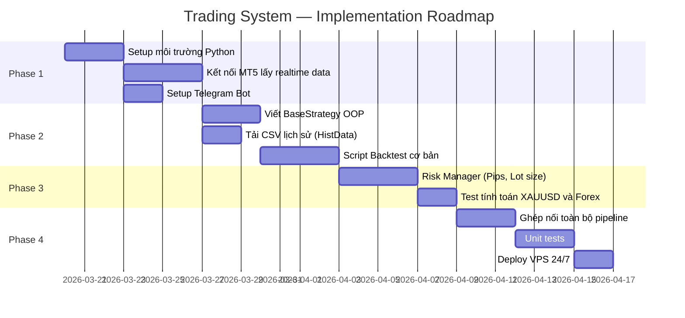

# Trading System — Planning & Roadmap

**Date**: 20 Mar 2026  
**Status**: Draft  

---

## Lộ trình Triển khai (4 Phases)

---

## Phase 1 — Setup & Data Foundation

**Mục tiêu**: Lấy được dữ liệu realtime từ MT5 và in ra terminal. Telegram bot hoạt động.

### Tasks

| ID | Task | Priority | Effort | Dependencies |
|---|---|---|---|---|
| P1-01 | Khởi tạo project, cấu trúc thư mục, `requirements.txt` | High | 0.5d | — |
| P1-02 | Cài đặt MT5 terminal + tài khoản Demo | High | 0.5d | — |
| P1-03 | Viết `DataManager.connect_mt5()` và `get_realtime_ohlcv()` | High | 2d | P1-02 |
| P1-04 | Test lấy dữ liệu XAUUSD và EURUSD, in ra DataFrame | High | 1d | P1-03 |
| P1-05 | Tạo Telegram Bot qua BotFather, lấy token + chat_id | High | 0.5d | — |
| P1-06 | Viết `TelegramNotifier.send_message()` đơn giản | Medium | 1d | P1-05 |
| P1-07 | Viết `config.yaml` với cấu trúc đầy đủ | High | 0.5d | — |

**Deliverable**: Script `main.py` chạy được, in dữ liệu nến XAUUSD ra terminal, gửi được tin nhắn test lên Telegram.

---

## Phase 2 — Strategy Framework & Backtest Cơ Bản

**Mục tiêu**: Có BaseStrategy hoạt động. Chạy backtest đơn giản trên CSV.

### Tasks

| ID | Task | Priority | Effort | Dependencies |
|---|---|---|---|---|
| P2-01 | Viết `BaseStrategy` abstract class | High | 1d | P1-07 |
| P2-02 | Viết `HistoricalLoader.load_from_csv()` | High | 1d | P1-07 |
| P2-03 | Tải dữ liệu XAUUSD M15, H1 từ HistData.com | High | 0.5d | P2-02 |
| P2-04 | Cài `pandas-ta` và viết `MACDCrossoverStrategy` | High | 2d | P2-01 |
| P2-05 | Cài `vectorbt` và viết `BacktestEngine` cơ bản | High | 2d | P2-04 |
| P2-06 | Chạy backtest MACDCrossover trên XAUUSD H1, xem báo cáo | Medium | 1d | P2-05 |
| P2-07 | Viết thêm `RSI_EMA_Strategy` như ví dụ thứ hai | Medium | 2d | P2-01 |

**Deliverable**: `backtest.py` chạy được MACDCrossoverStrategy trên CSV, xuất Winrate + Drawdown + Sharpe.

---

## Phase 3 — Risk Management Module

**Mục tiêu**: Tính chính xác Lot size, SL, TP cho cả Forex lẫn Vàng.

### Tasks

| ID | Task | Priority | Effort | Dependencies |
|---|---|---|---|---|
| P3-01 | Nghiên cứu Pip value formula cho XAUUSD và EURUSD | High | 0.5d | — |
| P3-02 | Viết `RiskManager.get_pip_value(symbol)` | High | 1d | P3-01 |
| P3-03 | Viết `RiskManager.calculate_lot_size(symbol, sl_pips)` | High | 1.5d | P3-02 |
| P3-04 | Viết `RiskManager.calculate_tp(entry, sl, action, rr)` | High | 1d | P3-02 |
| P3-05 | Viết `RiskManager.build_complete_signal(raw_signal)` | High | 1d | P3-03, P3-04 |
| P3-06 | Unit test: kiểm tra với balance 10,000 USD, risk 1.5%, SL 55 pips XAUUSD | High | 1d | P3-05 |
| P3-07 | Unit test: kiểm tra với EURUSD, SL 30 pips | High | 0.5d | P3-05 |

**Deliverable**: `RiskManager` tính đúng Lot size theo công thức, có unit tests pass.

---

## Phase 4 — Integration, Testing & Deploy

**Mục tiêu**: Toàn bộ pipeline hoạt động realtime. Deploy lên VPS 24/7.

### Tasks

| ID | Task | Priority | Effort | Dependencies |
|---|---|---|---|---|
| P4-01 | Ghép `DataManager` → `Strategy` → `RiskManager` → `TelegramNotifier` | High | 2d | Phase 1-3 |
| P4-02 | Implement `stream_on_new_bar()` callback trong DataManager | High | 1d | P4-01 |
| P4-03 | Xử lý lỗi: reconnect MT5 tự động, log lỗi | High | 1d | P4-01 |
| P4-04 | Integration test: chạy trên account Demo, nhận tín hiệu Telegram | High | 1d | P4-02 |
| P4-05 | Viết unit tests cho tất cả module | Medium | 2d | P4-01 |
| P4-06 | Chuẩn bị VPS (Ubuntu + Python + MT5 via Wine hoặc Windows VPS) | Medium | 1d | — |
| P4-07 | Deploy lên VPS, cấu hình systemd service / supervisor | High | 1d | P4-06 |
| P4-08 | Monitoring: log rotation, alert khi bot chết | Medium | 0.5d | P4-07 |

**Deliverable**: Bot chạy 24/7 trên VPS, tự động gửi tín hiệu Telegram khi có cơ hội giao dịch.

---

## Stack Kỹ thuật (Tech Stack)

| Layer | Công nghệ | Lý do |
|---|---|---|
| Language | Python 3.10+ | Ecosystem phong phú cho finance & ML |
| Realtime Data | `MetaTrader5` (Python) | Miễn phí, không delay, data chính xác |
| Historical Data | HistData.com CSV / Dukascopy | Miễn phí, chất lượng cao |
| Technical Indicators | `pandas-ta` | Dễ dùng, tích hợp Pandas |
| Backtest | `vectorbt` | Vectorized, nhanh, biểu đồ đẹp |
| Telegram | `python-telegram-bot` | Official, async support |
| Config | `PyYAML` | Human-readable, dễ chỉnh sửa |
| Testing | `pytest` | Standard Python testing |
| Logging | `logging` (built-in) | Không cần thêm dependency |
| Deploy | AWS EC2 T2.micro / DigitalOcean Droplet | Chi phí thấp (~$5-10/tháng) |
| Process Manager | `systemd` / `supervisor` | Tự restart khi crash |

---

## Rủi ro & Giải pháp (Risks & Mitigations)

| Rủi ro | Mức độ | Giải pháp |
|---|---|---|
| MT5 không chạy trên Linux | Cao | Dùng Windows VPS, hoặc Wine + MT5 |
| Pip value tính sai cho XAUUSD | Cao | Lấy pip_value từ MT5 symbol_info thay vì hardcode |
| Telegram rate limit | Thấp | Cache tín hiệu, không gửi duplicate trong 1 nến |
| VPS bị mất kết nối internet | Trung bình | Systemd auto-restart + monitoring alert |
| Overfitting trong backtest | Trung bình | Dùng walk-forward validation, out-of-sample test |

---

## Định nghĩa Done (Definition of Done)

Một phase được coi là **Done** khi:
1. Tất cả tasks trong phase hoàn thành
2. Code được review (tự review hoặc peer review)
3. Unit tests viết xong và pass
4. Docs cập nhật phản ánh implementation thực tế
5. Không có critical bug đã biết
